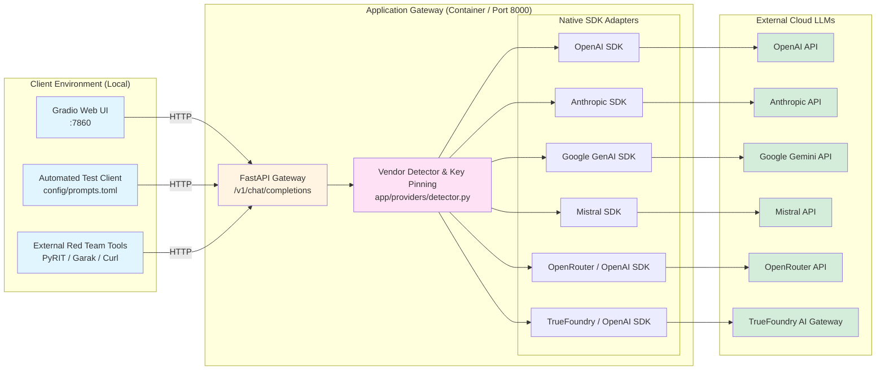

# LLM Remote Sandbox

## Overview
This sandbox provides a robust **environment for Red Teaming remote, commercial Large Language Model (LLM) APIs**. As the remote counterpart to `sandboxes/llm_local`, it exposes a unified, OpenAI-compatible API gateway that routes requests to major cloud LLM providers using their **official native Python SDKs**—without relying on orchestration frameworks like `langchain` or `mirascope`.

## Supported Providers & SDKs

The sandbox supports direct integration with 6 popular LLM providers via their native SDKs:

| Provider | Native SDK | Primary Credential Env Var | Alternative Credential Env Var | Default Model |
|---|---|---|---|---|
| **OpenAI** | `openai` | `OPENAI_API_KEY` | - | `gpt-4o-mini` |
| **Anthropic** | `anthropic` | `ANTHROPIC_API_KEY` | - | `claude-3-5-haiku-latest` |
| **Google Gemini** | `google-genai` | `GEMINI_API_KEY` | `GOOGLE_API_KEY` | `gemini-3.6-flash` |
| **Mistral AI** | `mistralai` | `MISTRAL_API_KEY` | - | `mistral-small-latest` |
| **OpenRouter** | `openrouter` | `OPENROUTER_API_KEY` | - | `meta-llama/llama-3.3-70b-instruct` |
| **TrueFoundry** | `openai`* | `TRUEFOUNDRY_API_KEY` | `TFY_API_KEY` | `openai/gpt-4o-mini` |

> *\* **Note on TrueFoundry**: TrueFoundry's AI Gateway is built from the ground up as an OpenAI-compatible API gateway. TrueFoundry's platform SDK (`truefoundry-sdk` / `truefoundry`) manages Kubernetes workloads, deployments, and ML tracking, but does not provide an LLM completion client. TrueFoundry's official documentation, playground, and tutorials prescribe using the standard `openai` SDK configured with `base_url="https://gateway.truefoundry.ai"`.*

---

## ⚠️ Critical Caution for Red Teaming Remote APIs

When testing against remote LLM servers instead of local instances, keep in mind:

1. **Policy Enforcement & Account Suspension**: Remote providers enforce active safety filters and content moderation. Automated jailbreaking, prompt injection, or malicious payload testing may flag your account or result in API key revocation. Always use dedicated test credentials and review provider penetration testing terms.
2. **Denial of Wallet & Token Costs**: Automated fuzzing campaigns generate massive token volumes. Ensure you configure hard spending limits on provider dashboards before launching automated testing.
3. **Data Retention & Privacy**: Prompts transmitted to remote providers may be retained in server-side logs. Do not submit sensitive corporate credentials or confidential intelligence during testing.

---

## Architecture



---

## Vendor Detection & Key Pinning

The sandbox adheres to industry standards by supporting **Zero-Config Auto-Detection** while preventing key collision issues through **Explicit Pinning**:

### 1. Auto-Detection (Default: `vendor = "auto"`)
- If **exactly 1 vendor API key** is exported in your environment, that vendor is activated automatically.
- If **multiple keys are exported** (e.g., both `OPENAI_API_KEY` and `ANTHROPIC_API_KEY` exist in your shell), the sandbox selects the vendor following precedence:
  ```
  OpenAI > Anthropic > Gemini > Mistral > OpenRouter > TrueFoundry
  ```
  A warning is logged indicating which provider was selected and how to pin.

### 2. Explicit Pinning (Recommended in Multi-Key Environments)
You can pin your desired vendor without unsetting your other API keys using either:
- **Environment Variable**:
  ```bash
  export LLM_VENDOR=anthropic
  # Options: openai, anthropic, gemini, mistral, openrouter, truefoundry
  ```
- **Configuration File (`config/model.toml`)**:
  ```toml
  [default]
  vendor = "anthropic"
  ```

---

## Threat Modeling
The threat model for this Remote LLM architecture is available in:
- [LLM_REMOTE_TM_report.md](threat_model/LLM_REMOTE_TM_report.md)

---

## Prerequisites
- **uv** – Python package manager (`pip install uv` if not installed)
- **Podman** (or Docker – replace `podman` with `docker` in the Makefile if desired)
- An active API key from at least one supported remote provider

---

## Configuration

### Model Configuration (`config/model.toml`)
Controls vendor selection, per-vendor default models, and gateway URLs:
```toml
[default]
vendor = "auto"          # "auto" or "openai", "anthropic", "gemini", etc.
# model = "gpt-4o-mini"  # Optional global override

[openai]
model = "gpt-4o-mini"

[anthropic]
model = "claude-3-5-haiku-latest"

[gemini]
model = "gemini-2.5-flash"

[mistral]
model = "mistral-small-latest"

[openrouter]
model = "meta-llama/llama-3.3-70b-instruct"
base_url = "https://openrouter.ai/api/v1"

[truefoundry]
model = "openai/gpt-4o-mini"
base_url = "https://gateway.truefoundry.ai"
```

### Test Prompts (`config/prompts.toml`)
Defines automated test prompts organized by category (`basic`, `custom`, `security_probes`).

### Client Configuration (`config/client_config.toml`)
Configures a global pre-prompt or system instruction automatically prepended to client queries:
```toml
[client]
pre_prompt = "You are a helpful assistant. Please answer the user's question based on the context provided."
```

---

## Quick Start

```bash
# 1. Export your API key of choice
export OPENAI_API_KEY="sk-..."
# or: export ANTHROPIC_API_KEY="sk-ant-..."
# or: export GEMINI_API_KEY="..."

# 2. View available commands
make help

# 3. Build and run the sandbox container
make build
make up

# 4. Check status
curl http://localhost:8000/health

# 5. Launch interactive Gradio chat UI
make run-gradio-headless
```

The gateway runs at `http://localhost:8000`, and the Gradio web interface opens at `http://localhost:7860`.

---

## Available Commands

Run `make help` to see all commands:

**Container Operations:**
- `make build` - Build the container image
- `make up` - Run the container forwarding host API keys
- `make down` - Stop and remove the container
- `make clean` - Clean up containers, networks, and images

**Development:**
- `make install` - Install uv package manager
- `make sync` - Sync/install dependencies into `.venv`
- `make lock` - Update dependency lock file (`uv.lock`)

**Testing:**
- `make test` - Full setup + health check
- `make test-client` - Run automated prompt tests from `config/prompts.toml`
- `make test-unit` - Run pytest unit and integration test suite

**UI:**
- `make run-gradio-headless` - Build, start server, and launch containerized Gradio interface
- `make stop-gradio` - Stop the Gradio container

**Code Quality:**
- `make format` - Run isort and black formatters
- `make mypy` - Run mypy static type checker

---

## Testing the Remote Sandbox

### Health Check
```bash
curl http://localhost:8000/health
```
Example response:
```json
{
  "status": "ok",
  "vendor": "openai",
  "model": "gpt-4o-mini"
}
```

### Chat Completion (OpenAI-compatible)
```bash
curl -X POST http://localhost:8000/v1/chat/completions \
  -H "Content-Type: application/json" \
  -H "Authorization: Bearer sk-mock-key" \
  -d '{
    "messages": [{"role": "user", "content": "Explain prompt injection in one sentence."}]
  }'
```

### Automated Testing
Run the automated prompt test suite:
```bash
make test-client
```

---

## Project Structure
```
.
├── config/                   # Configuration files
│   ├── client_config.toml   # System prompt and client settings
│   ├── model.toml           # Model & vendor settings
│   └── prompts.toml         # Automated test prompts
├── app/                      # FastAPI gateway application
│   ├── __init__.py
│   ├── main.py              # FastAPI server entry point
│   └── providers/           # Native SDK vendor implementations
│       ├── __init__.py      # Router and provider factory
│       ├── base.py          # Abstract base provider & schemas
│       ├── detector.py      # Vendor detection & key pinning logic
│       ├── openai_provider.py      # OpenAI SDK integration
│       ├── anthropic_provider.py   # Anthropic SDK integration
│       ├── gemini_provider.py      # Google GenAI SDK integration
│       ├── mistral_provider.py     # Mistral SDK integration
│       ├── openrouter_provider.py  # OpenRouter integration
│       └── truefoundry_provider.py # TrueFoundry AI Gateway integration
├── client/                   # Client testing scripts
│   ├── __init__.py
│   ├── main.py              # Automated test runner
│   └── gradio_app.py        # Gradio chat UI
├── tests/                    # Unit and integration test suite
│   └── test_detector_and_routes.py
├── threat_model/            # Threat modeling artifacts
│   └── LLM_REMOTE_TM_report.md
├── Containerfile            # Container definition
├── entrypoint.sh            # Container entrypoint script
├── Makefile                 # Developer and orchestration commands
├── packages.txt             # System dependencies
├── pyproject.toml           # uv project definition
├── uv.lock                  # Dependency lock file
└── README.md                # Sandbox documentation
```

---

## Troubleshooting

**Health check returns warning status:**
- Message: `"Server running but no vendor API key configured"`
- Fix: Ensure you have exported at least one valid vendor key (`OPENAI_API_KEY`, `ANTHROPIC_API_KEY`, etc.) before running `make up`.

**Switching between multiple exported keys:**
- If you have multiple keys in your shell, set `LLM_VENDOR`:
  ```bash
  export LLM_VENDOR=mistral
  make down && make up
  ```

**Port conflicts:**
- Port 8000: `make clean` removes existing containers.
- Port 7860: `make stop-gradio` stops lingering Gradio instances.
